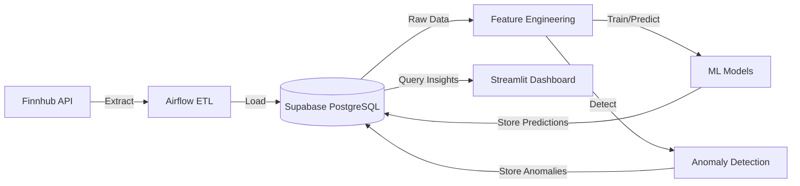

# ML-Powered Stock Market Analytics Pipeline

[](https://python.org)
[](https://airflow.apache.org)
[](https://docker.com)
[](https://streamlit.io)
[](https://supabase.com)

> A production-grade stock market analytics platform that seamlessly orchestrates data ingestion, processing, and machine learning pipelines.

This platform automates the extraction of financial data from the Finnhub API, stores it securely in Supabase PostgreSQL, and orchestrates ETL workflows using Apache Airflow. It features advanced machine learning models for price prediction and anomaly detection, presenting actionable insights through a rich Streamlit dashboard.

---

## Architecture Overview



## Key Features

- **Automated Data Pipelines**: Robust daily ETL jobs scheduled after market close.
- **Historical Data Backfill**: Readily available 1-year OHLCV data spanning 7 major tech stocks.
- **Advanced Feature Engineering**: Computation of sophisticated technical indicators (Moving Averages, Volatility, Capital Flow).
- **Machine Learning Forecasting**: Next-day closing price predictions utilizing Linear Regression and Random Forest models.
- **Market Anomaly Detection**: Proactive identification of unusual market behaviors via Isolation Forests.
- **Interactive Visualization**: Comprehensive 5-page Streamlit dashboard featuring interactive Plotly charts.

## Tracked Assets

The pipeline actively monitors the following high-cap technology stocks:

| Ticker    | Company Name    | Sector               |
| --------- | --------------- | -------------------- |
| **AAPL**  | Apple Inc.      | Consumer Electronics |
| **MSFT**  | Microsoft Corp. | Software             |
| **NVDA**  | NVIDIA Corp.    | Semiconductors       |
| **AMZN**  | Amazon.com Inc. | E-Commerce           |
| **GOOGL** | Alphabet Inc.   | Internet Content     |
| **META**  | Meta Platforms  | Internet Content     |
| **TSLA**  | Tesla Inc.      | Auto Manufacturers   |

---

## Getting Started

### Prerequisites

Ensure you have the following installed and configured before proceeding:

- [Docker & Docker Compose](https://www.docker.com/products/docker-desktop/)
- [Finnhub API Key](https://finnhub.io/) (Free tier is sufficient)
- [Supabase Project](https://supabase.com/) (With PostgreSQL database initialized)

### Installation & Setup

**1. Clone the Repository**

```bash
git clone https://github.com/NishanthPechimuthu/-stock-market-analytics-pipeline.git
cd stock-market-analytics-pipeline
```

**2. Configure Environment Variables**

```bash
cp .env.example .env
# Open .env and securely add your Finnhub and Supabase credentials
```

**3. Initialize Volumes**

```bash
mkdir -p logs plugins models
```

**4. Deploy Infrastructure**

```bash
docker compose up -d --build
```

**5. Access Services**
| Service | URL | Default Credentials |
|---------|-----|---------------------|
| **Airflow UI** | [http://localhost:8080](http://localhost:8080) | `airflow` / `airflow` |
| **Streamlit Dashboard** | [http://localhost:8501](http://localhost:8501) | N/A |

---

## Operational Workflows

### 1. Data Backfill

To populate the database with historical data:

1. Navigate to the **Airflow UI** > **DAGs**
2. Unpause the `historical_backfill_dag`
3. Trigger it manually and await completion (~5 mins).

### 2. Model Training

To train the predictive models:

1. Unpause the `weekly_model_training_dag`
2. Trigger the pipeline. Artifacts will be serialized to the `models/` directory.

### 3. Automated Daily Operations

To enable ongoing daily ingestion:

1. Unpause the `daily_market_pipeline_dag`.
2. The pipeline is scheduled to run autonomously Monday–Friday at 10 PM UTC.

---

## Database Schema Mapping

| Table Name         | Description                                               |
| ------------------ | --------------------------------------------------------- |
| `stocks`           | Reference table for stock symbols and metadata.           |
| `raw_stock_prices` | Core table containing raw OHLCV time-series data.         |
| `stock_features`   | Processed technical indicators and rolling metrics.       |
| `predictions`      | ML-generated next-day closing price forecasts.            |
| `anomalies`        | Detected market outliers flagged by the Isolation Forest. |

[View Schema](./supabase.db.md)

## Machine Learning Engine

| Algorithm             | Role                 | Primary Metric Targets        |
| --------------------- | -------------------- | ----------------------------- |
| **Linear Regression** | Baseline Prediction  | RMSE, MAE, R²                 |
| **Random Forest**     | Advanced Forecasting | RMSE, MAE, R²                 |
| **Isolation Forest**  | Anomaly Detection    | Contamination / Outlier Score |

---

## Repository Structure

```text
├── .env                    # Environment variables (excluded from VC)
├── .env.example            # Environment template
├── docker-compose.yml      # Service orchestration
├── requirements.txt        # Python dependencies
├── docker/                 # Container definitions
│   ├── airflow.Dockerfile
│   └── streamlit.Dockerfile
├── dags/                   # Apache Airflow workflows
├── src/                    # Core business logic
│   ├── config.py           # Configuration management
│   ├── db.py               # Database drivers
│   ├── etl/                # Extract, Transform, Load modules
│   ├── features/           # Feature engineering logic
│   ├── ml/                 # Machine learning models
│   ├── anomaly/            # Anomaly detection scripts
│   └── capital_flow/       # MFI/Capital flow analysis
├── streamlit_app/          # Frontend visualization app
├── models/                 # Serialized model artifacts
├── logs/                   # System and Airflow logs
└── plugins/                # Custom Airflow plugins
```

## License

This project is open-sourced under the MIT License. Developed for educational, research, and portfolio demonstration purposes.
